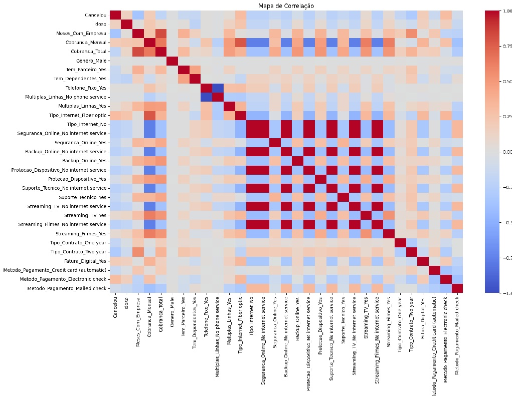

<h1>Jupiter Telecom X2: Previsão de Evasão de Clientes (Churn)</h1>

<h2>📊 Projeto Telecom X – Preparação de Dados e Modelagem Preditiva</h2>
Olá! Seja bem-vindo(a) ao repositório do Projeto Telecom X2, parte do desafio de Data Science do Programa ONE – Alura, turma G8. Este projeto visa analisar a evasão de clientes (churn) e construir modelos preditivos eficazes para apoiar a Telecom X, uma empresa de telecomunicações, na redução de sua alta taxa de cancelamentos.

<h2>🎯 Objetivo desta Etapa</h2>
Nesta fase do projeto, focamos em:

✅ Preparação dos dados para Machine Learning
✅ Criação e avaliação de modelos preditivos de churn

O fluxo seguido foi:

Extração dos arquivos tratados:
Os dados tratados, preparados previamente na fase de ETL, foram importados para iniciar a modelagem.

Correlação e seleção de variáveis:
Realizamos análises de correlação para identificar as variáveis mais relevantes para prever o cancelamento de clientes.

Preparação para modelagem:
Variáveis categóricas foram convertidas em variáveis dummy (OneHotEncoder), valores ausentes tratados, e variáveis não preditivas removidas.

Split dos dados:
Separação em conjuntos de treino (70%) e teste (30%) para garantir reprodutibilidade e avaliação justa dos modelos.

Criação dos modelos preditivos:
Foram criados modelos de Regressão Logística e Random Forest, com o objetivo de comparar desempenho e interpretar as variáveis mais influentes.

Avaliação dos modelos:
As métricas utilizadas incluíram accuracy, precision, recall, f1-score e ROC-AUC, garantindo uma análise completa da performance preditiva.

Interpretação e conclusões:
O projeto foi finalizado com insights claros sobre os fatores que mais influenciam a evasão e recomendações práticas para a equipe da Telecom X.

<h2>📝 Relatório Final e Considerações</h2>
Ao final desta etapa, foi elaborado um relatório detalhado contendo:

Introdução: Problema de negócio e objetivo da análise.

Processo de preparação dos dados: Extração, limpeza, transformação e seleção de variáveis.

Criação dos modelos: Descrição dos modelos utilizados, razões da escolha e parâmetros aplicados.

Avaliação dos modelos: Comparativo de métricas e análise dos resultados.

Conclusões e recomendações: Fatores mais relevantes para o churn e sugestões práticas para redução da evasão.

<h2>🛠️ Tecnologias Utilizadas</h2>
✅ Python
✅ Pandas – Manipulação e análise de dados
✅ Seaborn e Matplotlib – Visualizações estatísticas e personalizadas
✅ Scikit-learn – Construção e avaliação dos modelos de Machine Learning

<h2>🔜 Próximos Passos (Futuros)</h2>
Implementação de técnicas avançadas de balanceamento de classes (ex.: SMOTE)

Otimização de hiperparâmetros (GridSearchCV)

Deploy do modelo em ambiente produtivo para previsão em tempo real
